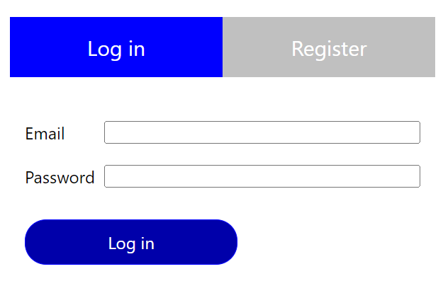
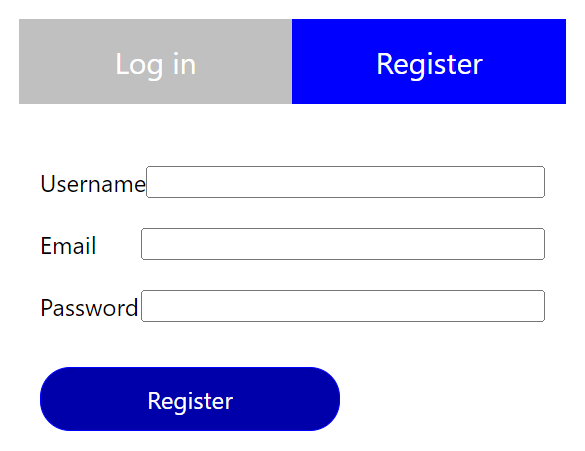

# How to use library

Boilerplate code for authentication. It is consist from frontend and backend part.
Frontend part is React component which represent `Login` and `Sign up` forms.

Backend part consist of functions used at netlify functions (Node JS).

Example usage can be found at https://github.com/pavel-kubik/mestle.

User information are stored in mongodb in collections `user`. Data structure

```
  username - unique username
  email - unique email
  password - hashed password
  salt - salt used at FE to hash password
```





Future development:

```
[ ] Prepare form for react-native
[ ] Export sign-in and sign-up form separately for better customization
[ ] Add refresh token
[ ] Add reset password
```

## FE

Import component `AuthForm`.

```
import AuthForm from 'jwt-auth-mongodb/dist/fe/component/AuthForm';

const [loggedUser, setLoggedUser] = useState(null); // to be defined in root component

<AuthForm //
  loggedUser={loggedUser}
  setLoggedUser={setLoggedUser}
  preSignIn={initBECall}
  preSignUp={initBECall}
  postSignIn={syncAttempts}
  postSignUp={syncAttempts}
  apiUrl={apiUrl}
  t={t}
/>
```

Parameters
| name | description |
|------|-------------|
| loggedUser | mandatory - loggedUser state |
| setLoggedUser | mandatory - loggedUser state setter |
| preSignIn | callback before sign-in |
| preSignUp | callback before sign-up |
| postSignIn | callback after sign-in |
| postSignUp | callback after sign-up |
| apiUrl | backend API base url |
| t | translation function |

## BE

Should be included just under netlify directory. It is not suitable for browser code.

### Auth endpoints

Next three endpoint must be defined.

`POST /netlify/functions/sign_in`
`POST /netlify/functions/sign_in_salt`
`POST /netlify/functions/sign_up`

#### Sign-in function

Create file at `/netlify/functions/sign_in/sign_in.ts` with content:

```
import { Handler } from '@netlify/functions';
import { signIn } from 'jwt-auth-mongodb/dist/be/auth';

export const handler: Handler = async (event, context) => {
  return await signIn(event, context);
};
```

#### Sign-in salt function

Create file at `/netlify/functions/sign_in_salt/sign_in_salt.ts` with content:

```
import { Handler } from '@netlify/functions';
import { signInSalt } from 'jwt-auth-mongodb/dist/be/auth';

export const handler: Handler = async (event, context) => {
  return await signInSalt(event, context);
};
```

#### Sign-up function

Create file at `/netlify/functions/sign_up/sign_up.ts` with content:

```
import { Handler } from '@netlify/functions';
import { signUp } from 'jwt-auth-mongodb/dist/be/auth';

export const handler: Handler = async (event, context) => {
  return await signUp(event, context);
};
```

### Secured call

Every secured endpoint should be wrapped with `validateJWT` at Back-end.

```
import { Handler } from '@netlify/functions';
import { validateJWT } from 'jwt-auth-mongodb';

export const handler: Handler = async (event) => {
  if (event.httpMethod !== 'GET') {
    return { statusCode: 404 };
  }

  const response = await validateJWT(event, async (userData) => {
    return {
      code: 200,
      body: {
        username: userData.username
      }
    };
  });
  return response;
};
```

Frontend should add following header:

```
'x-access-token': jwt
```

## MongoDB

You have to specify configuration of MongoDB from environmental variables.

It can be put in `.env` in project using this library. Configuration is automatically use with `netlify dev` command.

```
MONGODB_DATABASE=<dbname>
MONGODB_URI=mongodb://localhost:27017
TOKEN_KEY=123456789
```

# Library Development

## Test locally with npm link

With npm link. Note: Current project structure don't allow to use it.

Run `npm link` at library.
Run `npm link jwt-auth-mongodb` at target project.
It creates filesystem link to directory in `node_modules`.

## Test locally with gzip dependency

### At library

```
rm -rf dist
npm run build
npm pack
```

Test pack content with `npm pack --dry-run`.

### At project using library

```
npm i ../jwt-auth-mongodb/jwt-auth-mongodb-1.0.6.tgz
rm -rf node_modules/.cache
npm start
```

## Deploy library into npmjs

`npm publish`
